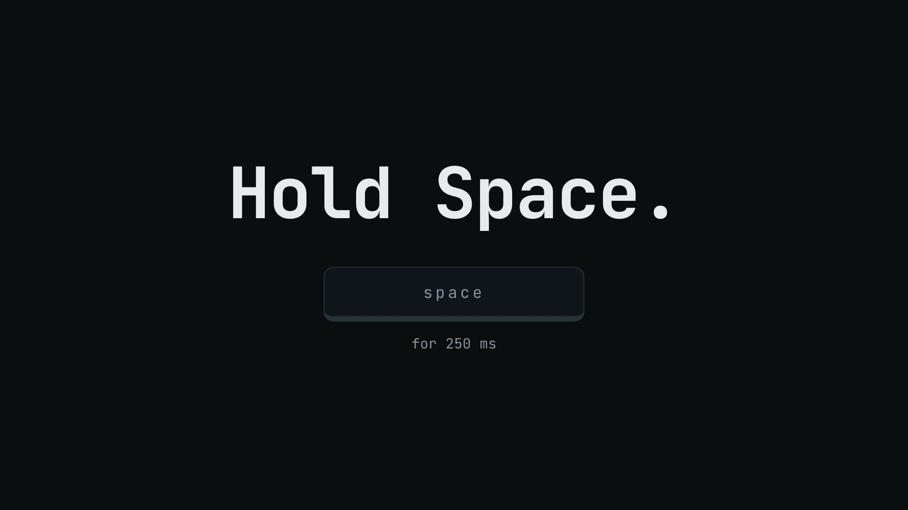
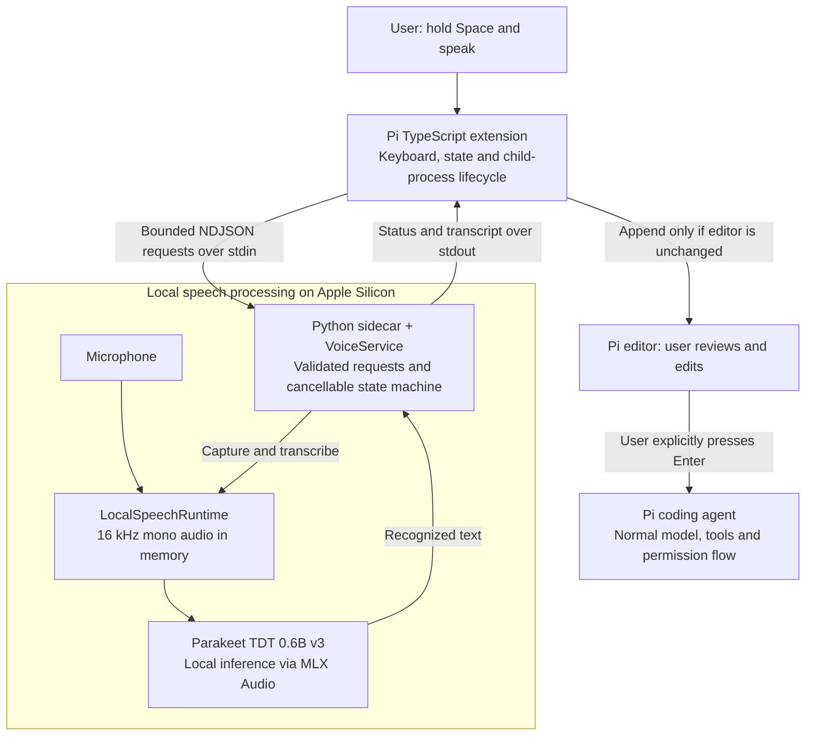

# Pi Voice

Local push-to-talk dictation for the [Pi coding agent](https://github.com/earendil-works/pi). Hold Space, speak, release, review the transcript, and press Enter. Pi remains the only agent and handles tools—including computer use—through its normal permission flow.

```text
microphone → Parakeet TDT → Pi editor → your review → normal Pi submission
```

[](https://github.com/JairajSustained/pi-voice/raw/main/brag-output/brag.mp4)

[Watch the 22-second demo](https://github.com/JairajSustained/pi-voice/raw/main/brag-output/brag.mp4): hold Space, speak, release, review, Enter.

Pi Voice is an experimental, macOS-first Pi package. Audio and transcription stay local, and assistant responses are displayed rather than spoken.

## Requirements

- Apple Silicon Mac running macOS 14 or newer
- Python 3.11–3.14
- [uv](https://docs.astral.sh/uv/getting-started/installation/)
- [Pi](https://github.com/earendil-works/pi) 0.85.1 or newer
- A terminal with enhanced Kitty keyboard events, such as iTerm2 (tested with 3.6.11), for hold-Space input
- Enough disk space and unified memory for the 600M-parameter speech model

## Install

Install directly from GitHub:

```bash
pi install git:github.com/JairajSustained/pi-voice@v0.1.0
```

Restart Pi or run:

```text
/reload
```

Then enable dictation:

```text
/voice
```

On first use, `uv` creates an isolated Python environment inside Pi's package checkout. Every launch checks that environment against the committed lockfile, so `pi update` cannot leave stale dependencies behind. The Parakeet model loads lazily on the first transcription and may need to download model files, so that transcription can take much longer than later ones.

## Use

When Pi is idle:

1. Hold **Space** for at least 250 ms. The editor cursor turns red while recording.
2. Speak your request.
3. Release **Space**. The cursor turns amber while Pi Voice transcribes.
4. Review the transcript inserted into Pi's editor.
5. Press Enter when it is correct.

A quick Space tap inserts exactly one normal space. Existing draft text is preserved and the transcript is appended with appropriate spacing. If the draft changes while transcription is running, Pi Voice refuses to insert the transcript rather than overwriting your edits.

`F8` toggles recording as a fallback. On Mac keyboards configured for media controls, use `Fn+F8`. You can also use `/voice start` and `/voice stop`.

## Commands

| Command | Behavior |
|---|---|
| `/voice`, `/voice on` | Enable dictation and start the local sidecar. |
| `/voice off` | Cancel work, stop the sidecar, and disable dictation. |
| `/voice start` | Begin recording. |
| `/voice stop` | Stop and transcribe. |
| `/voice cancel` | Cancel recording or discard an active transcription result. |
| `/voice status` | Show the current state. |
| `/voice ping` | Test the TypeScript-to-Python protocol without loading the model. |

Recordings are capped at 60 seconds. Empty and very short captures are rejected.

## Privacy and safety

- No network listener is opened.
- Audio and transcripts are not written to disk by Pi Voice.
- Audio is processed locally with a pinned revision of the Parakeet model. The model is downloaded from Hugging Face on first use unless already cached.
- Transcripts are never submitted automatically.
- Existing Pi permission gates remain authoritative.
- Pi output, tool output, code, URLs, and secrets are never sent to speech synthesis; this project contains no TTS path.
- Sidecar protocol messages are validated and size-bounded.

Treat speech recognition as untrusted input. Review names, addresses, amounts, recipients, and destructive actions carefully before pressing Enter.

## Configuration

Pi Voice normally launches the package-local environment. To use a different compatible Python interpreter:

```bash
export PI_VOICE_PYTHON=/absolute/path/to/python
```

The extension adds this repository's `src` directory to `PYTHONPATH`, so the selected interpreter only needs the dependencies declared in `pyproject.toml`.

To use a custom `uv` executable:

```bash
export PI_VOICE_UV=/absolute/path/to/uv
```

## Troubleshooting

### Hold-Space is unavailable

Use `F8`, `/voice start`, and `/voice stop`. Hold-Space requires Pi's enhanced keyboard protocol and works only while the terminal is focused.

### Microphone access fails

Grant microphone access to your terminal under **System Settings → Privacy & Security → Microphone**, then restart Pi.

### Sidecar startup fails

Clone the repository and run the protocol smoke test directly:

```bash
git clone https://github.com/JairajSustained/pi-voice.git
cd pi-voice
uv sync --locked --python 3.11
printf '%s\n%s\n' \
  '{"id":"1","method":"ping","params":{}}' \
  '{"id":"2","method":"shutdown","params":{}}' \
  | uv run python -m pi_voice.sidecar
```

### The first transcription appears stuck

The first transcription downloads, loads, and initializes the model. Later transcriptions reuse the warm sidecar. A hard operation timeout terminates the sidecar so the next request starts cleanly.

## Development

```bash
git clone https://github.com/JairajSustained/pi-voice.git
cd pi-voice
uv sync --locked --python 3.11
uv run pytest
uv run ruff check src tests
uv run mypy
```

Load the development extension without installing it:

```bash
pi --no-extensions --extension ./extensions/pi-voice.ts
```

See [ADR-001](docs/decisions/001-local-sidecar.md) for the architecture and trust-boundary decisions.

## Architecture



Pi Voice adds local speech recognition to Pi; Pi remains the only agent. The model is loaded on the first transcription and reused by the persistent sidecar. Audio stays in the speech runtime, while recognized text crosses the process boundary for review. After submission, Pi handles the text through its configured model and normal tool flow.

See the [dictation sequence and failure handling](docs/decisions/001-local-sidecar.md#dictation-sequence) for the request lifecycle, cancellation, and editor protection.

- `extensions/pi-voice.ts` integrates keyboard events, editor insertion, visual state, and lifecycle management with Pi.
- `src/pi_voice/sidecar.py` exposes a bounded NDJSON protocol over child-process stdin/stdout.
- `src/pi_voice/service.py` owns the cancellable recording/transcription state machine.
- `src/pi_voice/runtime.py` records 16 kHz mono PCM and lazily runs `mlx-community/parakeet-tdt-0.6b-v3` through `mlx-audio`.

There is no second agent loop, web server, wake word, background listener, transcript auto-submit, or response playback.

## Attribution

Pi Voice was extracted and modified from Hugging Face's Apache-2.0-licensed [speech-to-speech](https://github.com/huggingface/speech-to-speech) project. It downloads the NVIDIA Parakeet TDT 0.6B v3 model, which is governed by CC BY 4.0. Model weights are not included in this repository. See [NOTICE](NOTICE).

## License

Apache License 2.0. See [LICENSE](LICENSE).
